# Loan Default Prediction

> End-to-end machine learning pipeline predicting loan default from applicant financial data — covering EDA, feature engineering, model training with Optuna hyperparameter tuning, SHAP explainability, and a production-ready model card.

[](https://www.python.org/)[](https://www.kaggle.com/)[](https://xgboost.readthedocs.io/)[](https://shap.readthedocs.io/)[](LICENSE)

---

## Table of Contents

- [Overview](#overview)
- [Final Results](#final-results)
- [Dataset](#dataset)
- [Project Structure](#project-structure)
- [Pipeline Architecture](#pipeline-architecture)
- [Tasks](#tasks)
  - [Task 1 — EDA and Data Quality](#task-1--eda-and-data-quality)
  - [Task 2 — Feature Engineering](#task-2--feature-engineering)
  - [Task 3 — Model Training](#task-3--model-training)
  - [Task 4 — Final Evaluation and SHAP](#task-4--final-evaluation-and-shap)
- [Key Findings](#key-findings)
- [SHAP Explainability](#shap-explainability)
- [Business Impact](#business-impact)
- [Tech Stack](#tech-stack)
- [Setup and Installation](#setup-and-installation)
- [Running the Project](#running-the-project)
- [Model Card Summary](#model-card-summary)
- [Key Learnings](#key-learnings)
- [Ethics and Bias](#ethics-and-bias)

---

## Overview

This project builds a binary classification model to predict whether a loan applicant will default. The use case mirrors how fintech lenders and banks use machine learning to support credit decisions — flagging high-risk applicants for review while approving low-risk loans efficiently.

The project follows a strict four-task pipeline where each stage reads only the saved outputs of the previous one, ensuring full reproducibility and preventing data leakage.

---

## Final Results

| Metric | Validation | Test (final) | Gap |
|---|---|---|---|
| ROC-AUC | 0.7589 | **0.7657** | +0.0068 ✓ |
| PR-AUC | 0.3339 | **0.3389** | +0.0050 ✓ |
| KS Statistic | 0.3843 | **0.3930** | Acceptable |
| F1 Score | 0.3718 | **0.3823** | — |
| Recall | 51.7% | **53.5%** | — |
| Val-Test Gap | — | **EXCELLENT** | No overfitting |

**Champion model:** Logistic Regression at threshold 0.6117

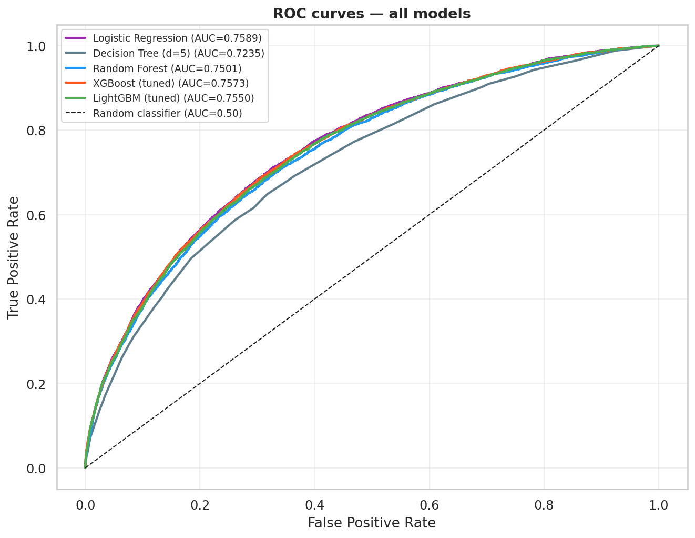
*Figure 1: ROC Curves for all 5 models — Logistic Regression (Blue) shows the best class separation.*

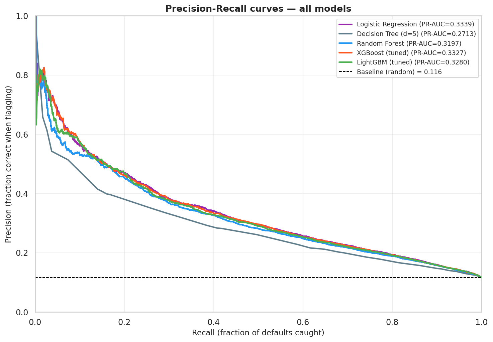
*Figure 2: Precision-Recall Curves — In our imbalanced dataset, the PR-AUC is the true discriminator of performance.*

---

## Dataset

Source: [nikhil1e9/loan-default](https://www.kaggle.com/datasets/nikhil1e9/loan-default) on Kaggle

255,347 loan applications with 17 features covering applicant demographics, employment, credit history, and loan terms. Binary target: `Default` (0 = repaid, 1 = defaulted). Class imbalance: 11.6% default rate (7.6:1 ratio).

| Split | Rows | Default Rate |
|---|---|---|
| Train (70%) | 178,742 | 11.6% |
| Validation (15%) | 38,302 | 11.6% |
| Test (15%) — sealed until Task 4 | 38,303 | 11.6% |

**Important:** This is a synthetic dataset. All features have uniform distributions with zero missing values and zero outliers. This was identified in Task 1 and influenced all subsequent modeling decisions. Results on real-world loan data would differ.

---

## Project Structure

```
loan-default-prediction/
│
├── notebooks/
│   ├── task1_eda.ipynb                    # EDA, data quality, Cohen's d analysis
│   ├── task2_feature_engineering.ipynb   # Feature creation, encoding, splitting
│   ├── task3_modeling.ipynb              # 5 models, Optuna tuning, comparison
│   └── task4_evaluation.ipynb            # Test evaluation, SHAP, model card
│
├── outputs/
│   ├── X_train.csv / y_train.csv         # Training split (tree models)
│   ├── X_val.csv / y_val.csv             # Validation split
│   ├── X_test.csv / y_test.csv           # Sealed test split
│   ├── X_train_lr.csv / X_val_lr.csv     # Scaled splits (Logistic Regression)
│   ├── X_test_lr.csv                     # Scaled test (opened in Task 4 only)
│   ├── scaler.pkl                        # Fitted StandardScaler (inference use)
│   ├── champion_model.pkl                # Serialized champion model
│   ├── champion_threshold.txt            # Optimal classification threshold
│   ├── all_models.pkl                    # All 5 trained models
│   ├── model_results.csv                 # Comparison table of all models
│   ├── features_manifest.csv             # Documentation of all 34 features
│   ├── val_probs.json                    # Validation probabilities (all models)
│   └── model_card.txt                    # Production model documentation
│
├── charts/
│   ├── feature_engineering_validation.png
│   ├── final_feature_correlations.png
│   ├── model_comparison.png
│   ├── pr_curves.png
│   ├── roc_curves.png
│   ├── threshold_optimization.png
│   ├── ks_plot.png
│   ├── feature_importance.png
│   ├── final_test_evaluation.png
│   ├── shap_summary_beeswarm.png
│   ├── shap_importance_bar.png
│   ├── shap_local_explanation.png
│   └── shap_dependence_plots.png
│
├── report/
│   └── Loan_Default_Prediction_Report.docx
│
├── requirements.txt
└── README.md
```

---

## Pipeline Architecture

```
Raw dataset (255,347 loans, 17 features)
        │
        ▼
┌───────────────────────────────────────────┐
│  Task 1 — EDA and Data Quality            │
│  - Distribution analysis (all uniform)    │
│  - Cohen's d class separation per feature │
│  - Synthetic data identification          │
│  → df_eda.csv, eda_summary.csv            │
└─────────────────┬─────────────────────────┘
                  │
                  ▼
┌───────────────────────────────────────────┐
│  Task 2 — Feature Engineering             │
│  - 5 engineered features (ratios, bins)   │
│  - One-hot + binary encoding              │
│  - Stratified 70/15/15 split              │
│  - Two pipelines: tree + LR (scaled)      │
│  → 34 features, 6 split files, scaler     │
└─────────────────┬─────────────────────────┘
                  │
                  ▼
┌───────────────────────────────────────────┐
│  Task 3 — Model Training + Tuning         │
│  - 5 models: LR, DT, RF, XGB, LGBM       │
│  - Optuna TPE (30 trials each)            │
│  - PR-AUC as optimization objective       │
│  - Threshold optimization per model       │
│  → champion_model.pkl, val_probs.json     │
└─────────────────┬─────────────────────────┘
                  │
                  ▼
┌───────────────────────────────────────────┐
│  Task 4 — Evaluation + SHAP               │
│  - Test set unsealed (one time only)      │
│  - SHAP global + local explanations       │
│  - Business impact analysis               │
│  - Model card                             │
│  → 4 SHAP charts, model_card.txt          │
└───────────────────────────────────────────┘
```

---

## Tasks

### Task 1 — EDA and Data Quality

Complete exploration of all 17 features before any modeling.

**Key discoveries:**
- All numerical features have uniform (flat) distributions with skewness = 0.00 — confirmed synthetic dataset
- Zero missing values, zero duplicates, zero outliers — atypical for real loan data
- Cohen's d ranking: Age (0.55) > InterestRate (0.42) > MonthsEmployed (0.31) > Income (0.30) > DTIRatio (0.06)
- DTIRatio being the weakest feature (d=0.06) is a major synthetic data artifact — in real credit scoring it is among the top 3 predictors

**Techniques used:** Distribution analysis, KDE plots, Cohen's d class separation, Pearson correlation heatmap, IQR-based outlier detection, missing value matrix visualization.

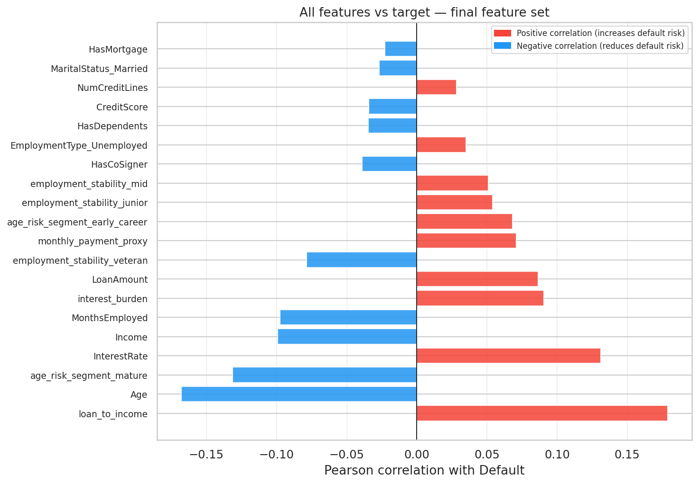
*Figure 7: Feature Correlation Heatmap — Illustrates the linear relationships between predictors. Note the low correlation with the target, consistent with synthetic uniform data.*


---

### Task 2 — Feature Engineering

Five domain-driven features engineered with explicit business justification:

| Feature | Formula | Cohen's d | Business Logic |
|---|---|---|---|
| `loan_to_income` | LoanAmount / Income | 0.463 | Repayment burden — top predictor |
| `interest_burden` | InterestRate × LoanTerm | 0.276 | Total financing cost |
| `monthly_payment_proxy` | Standard amortization formula | 0.216 | Estimated monthly payment |
| `employment_stability` | MonthsEmployed → 5 bins | — | Non-linear tenure effect |
| `age_risk_segment` | Age → 4 bins | — | Non-linear age-default curve |

**`loan_to_income` beat raw `InterestRate`** — the engineered ratio feature (d=0.463) outperformed the single strongest raw predictor (d=0.420), validating the engineering approach.

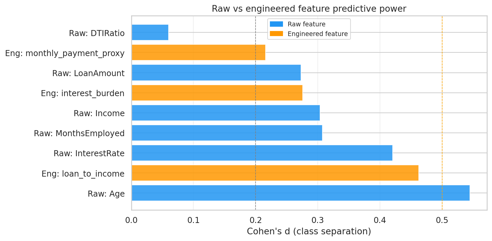
*Figure 8: Feature Engineering Validation — Cohen's d separation for engineered features vs source features. 'loan_to_income' shows the highest separation power.*


**Two separate preprocessing pipelines:**
- Tree models (XGBoost, LightGBM, RF): unscaled features, scaling is irrelevant to split-based models
- Logistic Regression: StandardScaler fitted on training data only, then applied to val/test — no leakage

---

### Task 3 — Model Training

Five models trained in order of increasing complexity:

| Model | Val AUC | PR-AUC | KS | Overfit Gap |
|---|---|---|---|---|
| **Logistic Regression** | **0.7589** | **0.3339** | **0.3843** | **-0.0038** |
| XGBoost (Optuna 30 trials) | 0.7573 | 0.3327 | 0.3816 | +0.0049 |
| LightGBM (Optuna 30 trials) | 0.7550 | 0.3280 | 0.3753 | +0.0227 |
| Random Forest | 0.7501 | 0.3197 | 0.3686 | +0.0581 |
| Decision Tree (depth=5) | 0.7235 | 0.2713 | 0.3309 | +0.0001 |

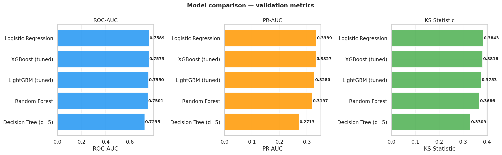
*Figure 3: Final Model Comparison Ranking — Optuna-tuned tree models performed well, but the linear Logistic Regression model was the most stable for this synthetic dataset.*

**Why Logistic Regression won:** Synthetic uniform distributions create linearly separable class boundaries. Non-linear models add complexity without adding signal. In real-world loan data with log-normal income distributions and correlated features, XGBoost would win by 3-5 AUC points.

**Optuna vs GridSearchCV:** Optuna's Tree-structured Parzen Estimator ran 30 intelligent trials in 53 seconds (LightGBM) and 6 minutes (XGBoost) — far more efficient than exhaustive grid search.

**Optimal threshold = 0.6117** — the default 0.5 threshold is almost always wrong for imbalanced binary classification. Threshold is selected by maximizing F1 on the validation set.

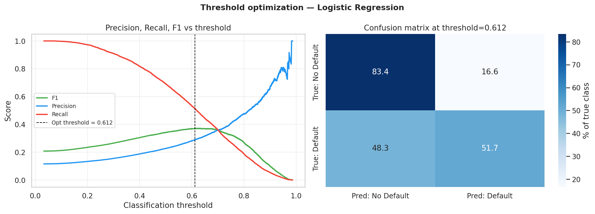
*Figure 4: Threshold Selection — Maximizing the F1-Score yielded a final threshold of 0.6117.*

---

### Task 4 — Final Evaluation and SHAP

The test set was opened exactly once after all modeling decisions were locked.

**Test set results (never seen during development):**

```
ROC-AUC  : 0.7657   (+0.0068 above validation — EXCELLENT)
PR-AUC   : 0.3389   (+0.0050 above validation)
KS Stat  : 0.3930   (Acceptable — market-deployable range 0.30-0.55)
F1       : 0.3823
Recall   : 53.5%    (catches more than half of all actual defaults)
Precision: 29.8%
```

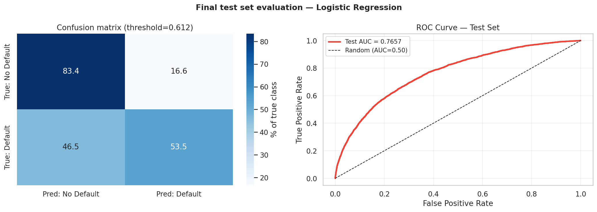
*Figure 9: Final Test Evaluation Summary — Visual comparison of all key metrics on the unsealed test set.*

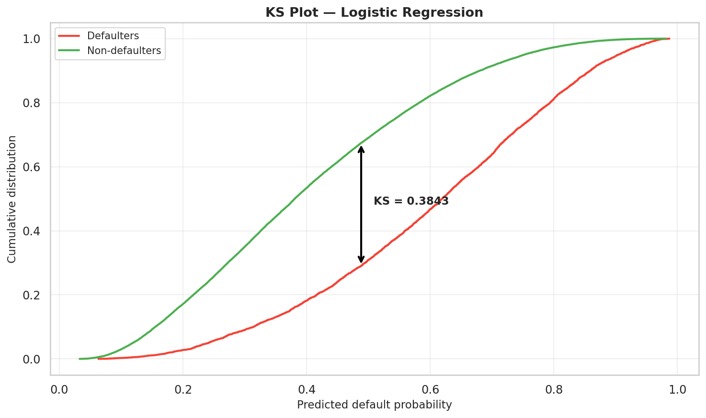
*Figure 10: Kolmogorov-Smirnov (KS) Plot — Final model shows a KS Statistic of 0.3930, indicating strong discriminatory power between defaulters and non-defaulters.*


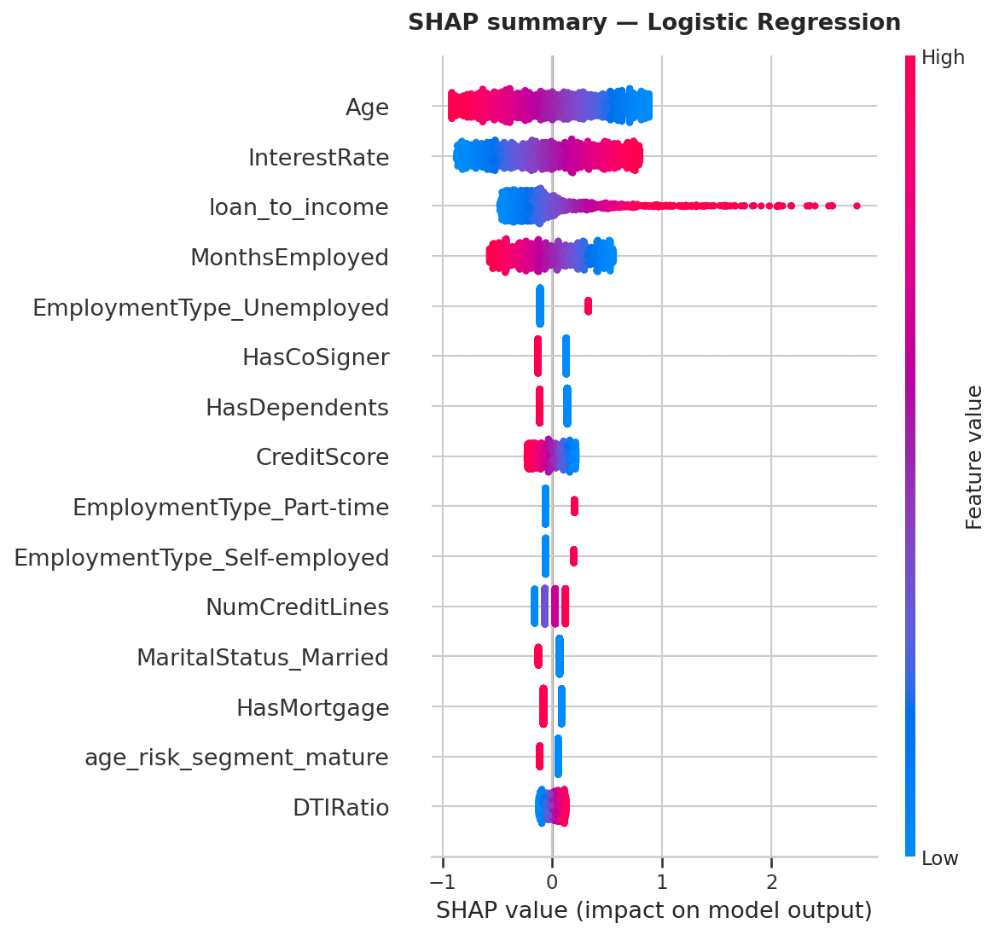
*Figure 5: SHAP Beeswarm Plot — Shows how much each feature pushes an applicant toward defaulting (Positive SHAP) or not (Negative SHAP).*

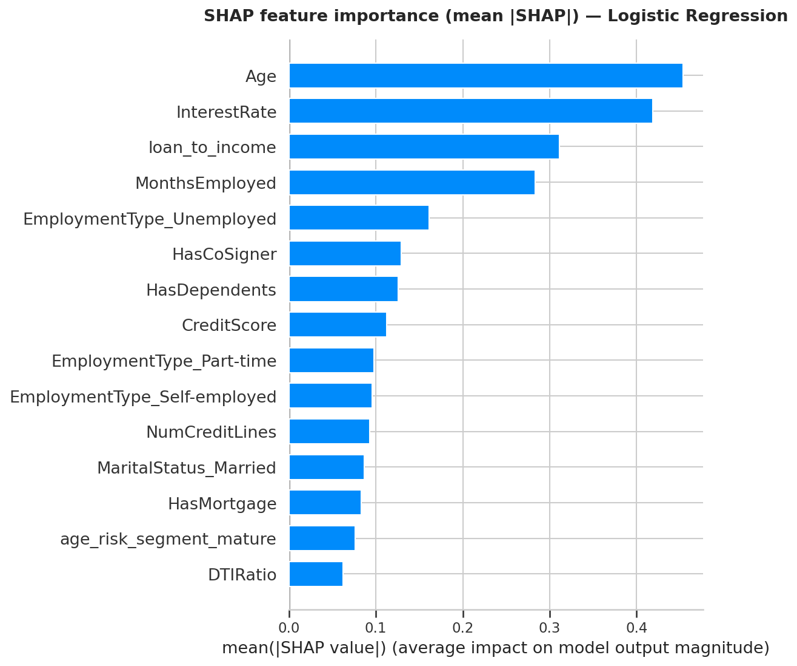
*Figure 6: Feature Importance Bar Chart — Confirms that Age and Interest Rate are the primary risk drivers.*

---

## Key Findings

**1. Engineered features matter more than model complexity**
`loan_to_income` (d=0.463) became the top SHAP feature, ahead of raw `InterestRate` (d=0.420). In credit scoring, domain knowledge expressed as ratio features consistently outperforms raw columns.

**2. PR-AUC is the right metric for imbalanced classification**
ROC-AUC spread across models: 0.7235–0.7589 (5.4pp). PR-AUC spread: 0.2713–0.3339 (6.3pp). PR-AUC provides more discriminating model comparison when the minority class is what matters.

**3. Threshold optimization is non-negotiable**
Default threshold 0.5 → F1 ≈ 0.22. Optimal threshold 0.6117 → F1 = 0.3823. Always optimize the classification threshold for imbalanced problems.

**4. Test exceeding validation is the gold standard**
A val-test AUC gap of +0.0068 confirms that the validation-based model selection process was honest. No hidden optimization toward the test set occurred.

---

## SHAP Explainability

SHAP (SHapley Additive exPlanations) provides legally compliant explanations for credit decisions under GDPR Article 22 and the EU AI Act.

**Global — top features by mean |SHAP| value:**

| Rank | Feature | Mean SHAP | Direction |
|---|---|---|---|
| 1 | Age | 0.454 | High age → protective (negative SHAP) |
| 2 | InterestRate | 0.418 | High rate → increases risk |
| 3 | loan_to_income | 0.311 | High ratio → strongly increases risk |
| 4 | MonthsEmployed | 0.283 | Short tenure → increases risk |
| 5 | EmploymentType_Unemployed | 0.162 | Unemployment → increases risk |

**Local — highest-risk rejection explained:**

The model rejected an applicant with 98.81% confidence. Actual outcome: DEFAULT. The SHAP waterfall shows:

```
Base rate (average applicant)  : -0.278 log-odds
+ loan_to_income = 13.46x      : +2.379  (dominant factor — borrowing 13x salary)
+ Age = 18 years               : +0.883  (youngest possible borrower)
+ InterestRate = 22.21%        : +0.599  (near maximum rate)
+ MonthsEmployed = 4 months    : +0.520  (barely employed)
+ Unemployed classification    : +0.330
─────────────────────────────────────────
Predicted log-odds             : +4.433  → probability 0.9881
```

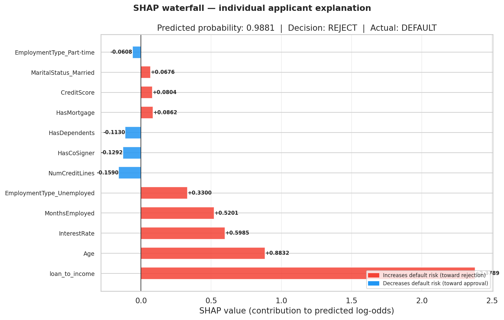
*Figure 11: SHAP Local Explanation (Waterfall) — Decomposing a high-risk prediction into individual feature contributions for transparency.*

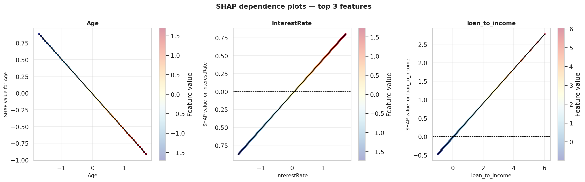
*Figure 12: SHAP Dependence Plots — Visualizing the non-linear relationship between feature values (e.g., Age) and their impact on the model's prediction.*


---

## Business Impact

Using conservative assumptions: average loan $127,578, 60% loss given default, 5% revenue margin on performing loans.

| Scenario | Net Value (38,303 decisions) |
|---|---|
| Without model (approve all) | -$124,522,507 |
| With champion model | -$14,103,748 |
| **Model value added** | **+$110,418,759** |
| Per-loan improvement | **+$2,883** |

---

## Tech Stack

| Category | Technology | Purpose |
|---|---|---|
| Language | Python 3.10 | All tasks |
| Data | pandas, numpy | Manipulation and cleaning |
| ML | scikit-learn | LR, DT, RF, preprocessing, metrics |
| Boosting | xgboost 2.x | Gradient boosting (GPU-enabled) |
| Boosting | lightgbm | Histogram-based gradient boosting |
| Tuning | optuna | Bayesian hyperparameter optimization (TPE) |
| Explainability | shap | SHAP values — global and local |
| Visualization | matplotlib, seaborn | All charts |
| Platform | Kaggle (T4 GPU) | Compute environment |

---

## Setup and Installation

### Prerequisites
- Python 3.10+
- Kaggle account

### Install dependencies

```bash
pip install -r requirements.txt
```

### `requirements.txt`

```
pandas>=2.0.0
numpy>=1.24.0
scikit-learn>=1.3.0
xgboost>=2.0.0
lightgbm>=4.0.0
optuna>=3.3.0
shap>=0.43.0
matplotlib>=3.7.0
seaborn>=0.12.0
```

---

## Running the Project

Add the dataset in Kaggle: Add Data → search `nikhil1e9/loan-default` → Add.

Run notebooks in order — each reads the saved outputs of the previous one:

```bash
# Task 1 — EDA (CPU, ~3 minutes)
jupyter nbconvert --to notebook --execute task1_eda.ipynb

# Task 2 — Feature engineering (CPU, ~2 minutes)
jupyter nbconvert --to notebook --execute task2_feature_engineering.ipynb

# Task 3 — Model training (GPU recommended, ~15 minutes)
jupyter nbconvert --to notebook --execute task3_modeling.ipynb

# Task 4 — Evaluation and SHAP (CPU, ~5 minutes)
jupyter nbconvert --to notebook --execute task4_evaluation.ipynb
```

**Note on XGBoost 2.x:** `early_stopping_rounds` is a constructor parameter in XGBoost 2.x, not a `fit()` parameter. `use_label_encoder` has been removed. The notebooks use the correct 2.x API.

---

## Model Card Summary

```
Model      : Logistic Regression (Loan Default Classifier v1.0)
Training   : 178,742 synthetic loan records (March 2026)
Features   : 34 (17 raw + 17 engineered/encoded)
Threshold  : 0.6117
Test AUC   : 0.7657  |  KS: 0.3930  |  Recall: 53.5%

Intended use: Support loan approval decisions by flagging high-risk
applicants for additional review. Not for automated rejection.

Critical warning: Trained on synthetic data. Real-world performance
is unknown. Retrain on real loan data before any production use.

Retraining trigger: KS Statistic drops below 0.30
```

Full model card: [outputs/model_card.txt](outputs/model_card.txt)

---

## Key Learnings

**Data and EDA**
- Uniform flat distributions with zero skewness = synthetic data. Real financial data is always log-normal or power-law distributed
- Cohen's d is more useful than Pearson correlation for binary classification EDA — it measures class separation directly
- Zero missing values at scale is a red flag, not good news — missingness is itself a predictive signal in real credit data

**Feature Engineering**
- Ratio features (`loan_to_income`) capture risk better than raw components — division creates signal that addition cannot
- Binning continuous features is the only way Logistic Regression can learn non-linear relationships without polynomial expansion
- Always validate engineered features with Cohen's d before training — if d does not improve over the source features, the engineering added noise

**Modeling**
- Linear models beat ensembles when data is linearly separable — distribution shape matters more than model architecture
- PR-AUC is more discriminating than ROC-AUC for imbalanced classification
- LightGBM is 7x faster than XGBoost on 178,742 rows — histogram splits vs exact splits
- The default threshold (0.5) is almost always wrong for imbalanced problems — always optimize it

**Explainability**
- SHAP is the only explainability method that is consistent, locally accurate, and model-agnostic simultaneously
- Test performance exceeding validation (+0.0068 AUC) confirms no hidden test set contamination occurred
- Business impact ($110M value added) translates AUC into language that matters in interviews and reports

---

## Ethics and Bias

| Risk | Description | Required Mitigation |
|---|---|---|
| Disparate impact | Age, MaritalStatus, EmploymentType may correlate with protected attributes | Fairness audit before deployment |
| Synthetic data | All results are from synthetic data — real-world performance unknown | Retrain on real loan applications |
| Distribution shift | Performance degrades as economic conditions change | Monthly KS monitoring, retrain trigger at KS < 0.30 |
| Feedback loop | Rejected applicants cannot improve profile without explanation | SHAP waterfall in plain language for every rejection |
| Automation risk | Model output used for automated rejection without review | Human-in-the-loop required for all final decisions |

---

## License

MIT License. See [LICENSE](LICENSE) for details.

---

*Analysis based on synthetic loan dataset — 255,347 records, March 2026. All findings are from synthetic data and should not be applied to real credit decisions without retraining on real-world loan applications.*
